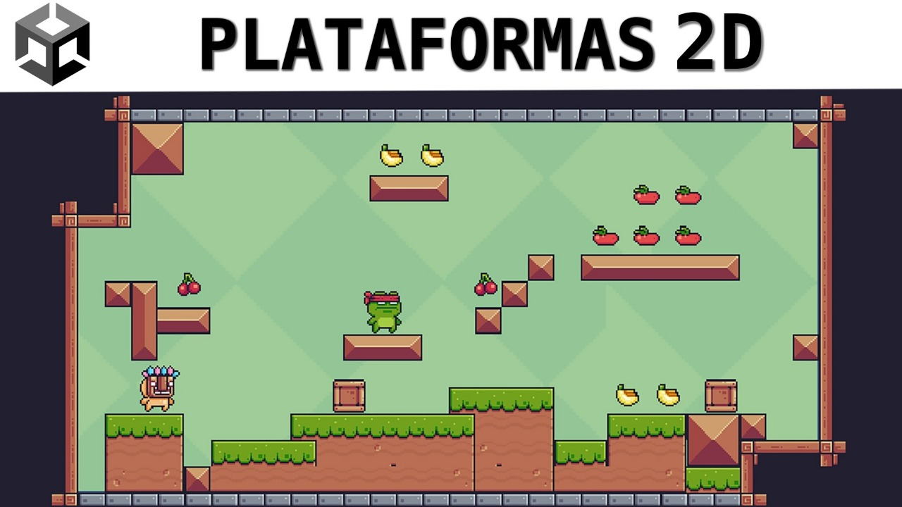

# Creación de Video Juego

    

  

    Short description
     
    <a href="https://reponame/issues/new?template=bug.md">Report bug</a>
    ·
    <a href="https://reponame/issues/new?template=feature.md&labels=feature">Request feature</a>
  

## Contenido

- [Introducción](#introducción)
- [Código Fuente](#código-fuente)
- [Planificación](#planificación)
- [Autores](#autores)
- [Copyright](#copyright)

## Introducción

- Nombre del proyecto
- Desarrollar un videojuego de plataformas 2D en Unity desde cero, aplicando conceptos de programación, diseño de niveles, animaciones y mecánicas de juego, con el fin de aprender y dominar el      proceso completo de creación de videojuegos.
- PC (Windows)
- Plataformas / Aventura
- Frog, Virtual guy y Pink man
- Plan de creación de VideoJuego.

## Código Fuente

* Lección 1  
  * > [Evidencia](https://github.com/xJuianUTNGx/2DGAMEPJSB/blob/main/Evidencia%20tutoriales/Tutorial-1-Capitulo-Escenario.pdf)
* Lección 2  
  * > [Evidencia]([tutoriales/Tutorial-2-Capitulo-Escenario.pdf](https://github.com/xJuianUTNGx/2DGAMEPJSB/blob/main/Evidencia%20tutoriales/Tutorial-2-Capitulo-Movimiento%20y%20Salto.pdf))
* Lección 3  
  * > [Evidencia](tutoriales/Tutorial-3-Capitulo-Escenario.pdf)
* Lección 4  
  * > [Evidencia](tutoriales/Tutorial-4-Capitulo-Escenario.pdf)
* Lección 5  
  * > [Evidencia](tutoriales/Tutorial-5-Capitulo-Escenario.pdf)
* Lección 6  
  * > [Evidencia](tutoriales/Tutorial-6-Capitulo-Escenario.pdf)
* Lección 7  
  * > [Evidencia](tutoriales/Tutorial-7-Capitulo-Escenario.pdf)
* Lección 8  
  * > [Evidencia](tutoriales/Tutorial-8-Capitulo-Escenario.pdf)
* Lección 9  
  * > [Evidencia](tutoriales/Tutorial-9-Capitulo-Escenario.pdf)
* Lección 10  
  * > [Evidencia](tutoriales/Tutorial-10-Capitulo-Escenario.pdf)
* Lección 11  
  * > [Evidencia](tutoriales/Tutorial-11-Capitulo-Escenario.pdf)
* Lección 12  
  * > [Evidencia](tutoriales/Tutorial-12-Capitulo-Escenario.pdf)
* Lección 13  
  * > [Evidencia](tutoriales/Tutorial-13-Capitulo-Escenario.pdf)
* Lección 14  
  * > [Evidencia](tutoriales/Tutorial-14-Capitulo-Escenario.pdf)
* Lección 15  
  * > [Evidencia](tutoriales/Tutorial-15-Capitulo-Escenario.pdf)
* Lección 16  
  * > [Evidencia](tutoriales/Tutorial-16-Capitulo-Escenario.pdf)
* Lección 17  
  * > [Evidencia](tutoriales/Tutorial-17-Capitulo-Escenario.pdf)
* Lección 18  
  * > [Evidencia](tutoriales/Tutorial-18-Capitulo-Escenario.pdf)
* Lección 19  
  * > [Evidencia](tutoriales/Tutorial-19-Capitulo-Escenario.pdf)
* Lección 20  
  * > [Evidencia](tutoriales/Tutorial-20-Capitulo-Escenario.pdf)
* Lección 21  
  * > [Evidencia](tutoriales/Tutorial-21-Capitulo-Escenario.pdf)
* Lección 22  
  * > [Evidencia](tutoriales/Tutorial-22-Capitulo-Escenario.pdf)
* Lección 23  
  * > [Evidencia](tutoriales/Tutorial-23-Capitulo-Escenario.pdf)
* Lección 24  
  * > [Evidencia](tutoriales/Tutorial-24-Capitulo-Escenario.pdf)
* Lección 25  
  * > [Evidencia](tutoriales/Tutorial-25-Capitulo-Escenario.pdf)
* Lección 26  
  * > [Evidencia](tutoriales/Tutorial-26-Capitulo-Escenario.pdf)
* Lección 27  
  * > [Evidencia](tutoriales/Tutorial-27-Capitulo-Escenario.pdf)
* Lección 28  
  * > [Evidencia](tutoriales/Tutorial-28-Capitulo-Escenario.pdf)
* Lección 29  
  * > [Evidencia](tutoriales/Tutorial-29-Capitulo-Escenario.pdf)
* Lección 30  
  * > [Evidencia](tutoriales/Tutorial-30-Capitulo-Escenario.pdf)
* Lección 31  
  * > [Evidencia](tutoriales/Tutorial-31-Capitulo-Escenario.pdf)
* Lección 32  
  * > [Evidencia](tutoriales/Tutorial-32-Capitulo-Escenario.pdf)
* Lección 33  
  * > [Evidencia](tutoriales/Tutorial-33-Capitulo-Escenario.pdf)
* Lección 34  
  * > [Evidencia](tutoriales/Tutorial-34-Capitulo-Escenario.pdf)
* Lección 35  
  * > [Evidencia](tutoriales/Tutorial-35-Capitulo-Escenario.pdf)
* VideoJuego

## Planificación

## Autores
Julian Soto Badillo

## Copyright
Derechos Reservados 2025
